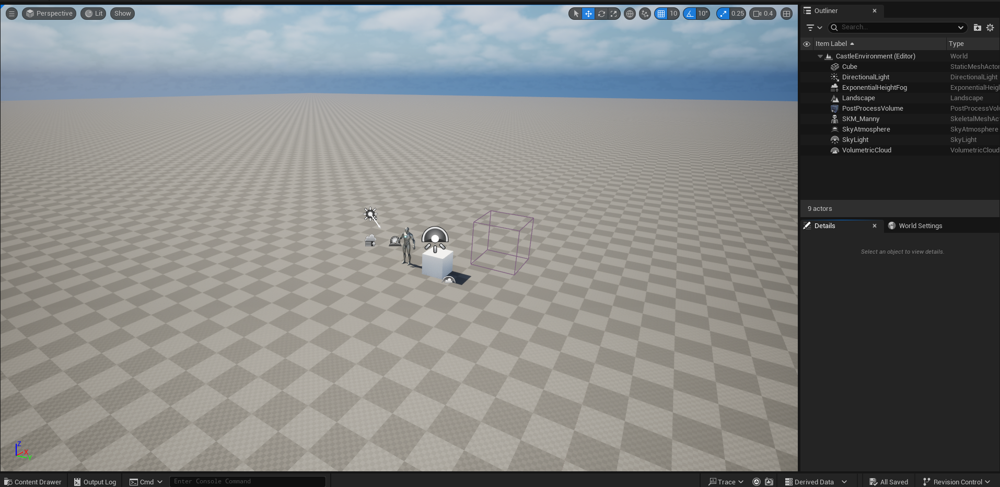

### What did you do last week?

Last week I deviated from my plan a little bit - I did create what will become my final game environment, but I didn't apply foliage in this environment yet like I talked about in last week's post. 
I did still work to familiarize myself with applying foliage to a landscape, but this was in a smaller test environment and won't be used in my final project. 
Part of the reason for this was because I wanted to brush up on most of the topics I've covered so far after the break, so I spent a fair amount of time on reviewing what I've learned so far. 
Furthermore, I decided to learn about Blueprints in Unreal, which is basically the alternative to setting game behaviors by coding them up in C++. 
I'm not sure how much I'll get to apply them to my project considering I've intended my focus to be on level design and not gameplay for this project, but they were an aspect of Unreal I was curious about and wanted some familiarity with. 
Overall, I spent more time this week than intended based on my workload planning, despite not achieving quite what I said I was going to, but I'm not sure I regret the deviation from the schedule. 

Here is a screenshot of what my final game environment looks like at this stage - mostly still a blank canvas - all I've added so far is lighting, sky, clouds, a post-process volume for controlling the exposure of the lighting I added, and a mannequin and cube for scale references. 

### What do you plan to do this week?

This upcoming week, I'm going to add an auto-material to the blank checkerboard landscape you see there to lay a base layer of grass and dirt textures. 
Then I'll be working on some of the large details of the environment as well, like adding a background of snow-capped mountains, and adjusting the landscape itself to build in some uneven terrain of hills and cliffs. 

### Are there any impediments in your way?

I'm pushing back adding foliage to my project, but I feel good about the adjustment so I think I'm still on track. 

### Reflection on the process:

Having a tightly planned schedule and sticking to it has been excellent for my focus and for the project most weeks, but investing some extra time this week and adjusting the order of some of my remaining plans was overall a positive experience for this week and I think in the best interest of the project. 
