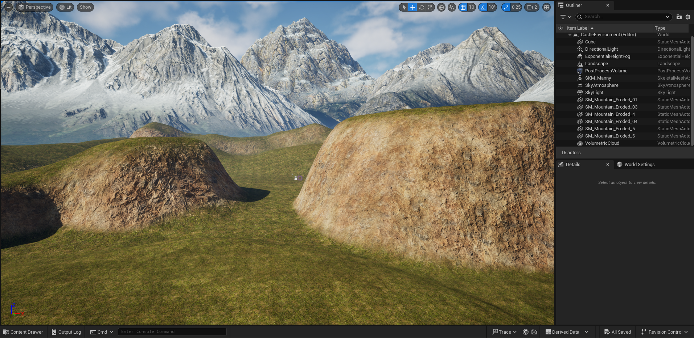
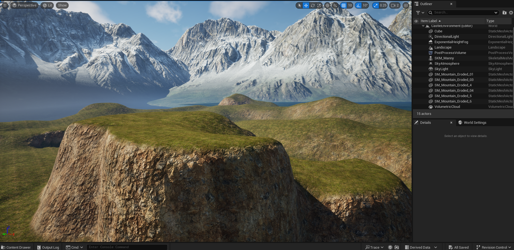
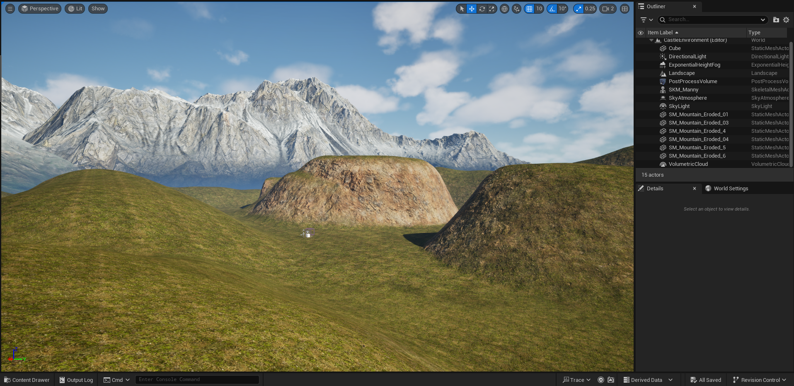
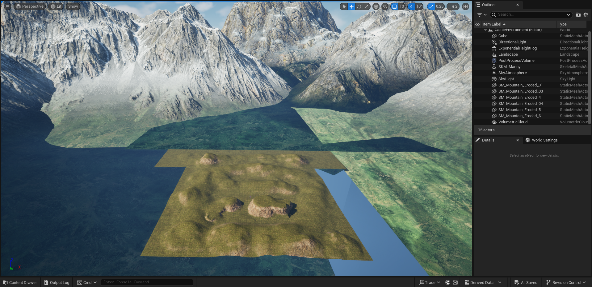

### What did you do last week?

Last week I added a base auto-material layer to the landscape board that includes grass, dirt, rock, and mud textures. 
Additionally, I added the large background details consisting of snow-capped mountains. 
I spent a bit of time adjusting my lighting, and the rest of the time playing with the elevation across the landscape board until I had the areas I desired. 
Below are screenshots of this progress:

This one above is my main cinematic shot now (compare to last week's post to really see how far it's come). 
You can still see my mannequin and cube references in the center between the two hills. 
The right foreground hill will contain the main completed castle when all is said and done, and if I have time, the left foreground hill will have a smaller ruin on the top of the plateau. 
The shots below are all other angles for those interested:

### What do you plan to do this week?

This week, I'll be working on adding bodies of water to the scene, adjusting the cliffs to be more rocky, and adding trees and other foliage (which will be the bulk of my efforts). 
The water will include a lake in the foreground of the cinematic shot, with a little river coming into it from the left of the scene and exiting the lake by winding between the two hills down the center of the shot. 

### Are there any impediments in your way?

Apparently getting distracted by other final projects, but I don't see that being a problem in the upcoming week since I've turned that one in already. 

### Reflection on the process:

It's all coming together and I'm proud of how closely it's aligning to my vision - even better, in a weird twist of fate, Bethesda announced a livestream tomorrow, 4/22, confirming leaks from the last couple days that an Oblivion remaster is actually about to drop after 20 years!
