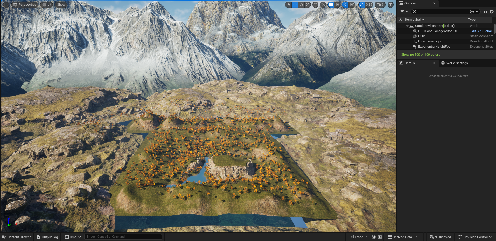

### What did you do last week?

Last week, I accomplished all three items I had on my list for the week in last week's post: adding water, adjusting the cliffs to appear more rocky/textured, and painting in large amounts of foliage to the scene. 
To be honest, this week was pretty time-intensive compared to my workload planning, but I feel it was well worth it; you can judge for yourself by comparing to the screenshots in last week's post. 
As always, here is my main cinematic shot:

One thing I noted was that I expected foliage to be the bulk of my time (and it did take plenty of time), but the cliffs were the thing that I ended up spending the most time on and which I still don't feel satisfied with.
To accomplish the effect, I essentially layered a few rocky static meshes in front of the elevated portions of the landscape grid that you see in last week's post; 
however, doing this requires a great deal more duplicating, rotating, scaling, and repositioning of the meshes than I initially thought and even more time to make it look natural and obscure any unrealistic features like the bottom of a mesh hanging out in midair or seeing holes through the back of a poorly positioned mesh. 
Despite several hours on this, I am not well pleased with the result but felt that I didn't have more time to spend perfecting it. 
I think that this is a skill that will simply need a great deal of time and practice to perfect. I got it to a place where it looks "good enough" for my main camera angles which are at enough of a distance, 
but it's the kind of thing where when you get up close you can see the flaws more readily. Here is an example of seeing cracks between the meshes or through the back of one:

Ultimately I decided to move on instead of being a perfectionist about this issue, as it's not noticeable from a distance or from most angles. 
As usual, here are my other bookmarked views of the scene for comparison to previous weeks' posts. 

One other thing you may note is I went back and added some additional large details; 
the lower hills between my main landscape board and the snow-capped mountains were an addition I thought worth the time for the additional realism they lend to the scene's depth of field. 

### What do you plan to do this week?

This week, I will finish out the project by adding the castle and small details to the scene, and time permitting, a smaller ruin as well. 

### Are there any impediments in your way?

I currently foresee no obstacles in my path.

### Reflection on the process:

The release earlier this week of the very remaster that served as the inspiration for this project has provided a really cool focal point as I reflect on this project. 
I found that I can gauge how much I've learned in the course of this project by playing the Oblivion remaster and finding myself aware of various tools or methods the devs likely applied during development. 
For instance, understanding from the file size of the game (120+GB) and from how incredible it looks that they likely utilized Nanite-level assets for just about every game asset 
(resulting in 8K instead of 4K or lower resolutions on all assets) 
or that the incredible draw distance of shots where you can see far into the distance means they must have overridden more distant LODs on many environmental objects without sacrificing the frame rate 
(perhaps relying on current-gen hardware to prevent frame rate drop?). 
Finding myself thinking in this way for the last couple of weeks has been a cool experience and showed me that I learned and retained more than I thought I did just a couple of weeks ago when I felt fuzzy after coming back to the project after spring break. 
For anyone who is interested in learning more about what the heck I'm talking about, here is a link to the release announcement livestream, 
in which members of Bethesda and Virtuos discuss how they applied some of the very same software I've been learning to produce the remaster, 
and some very cool side-by-side images of the original 2006 release compared to what modern Unreal Engine 5 is capable of producing in the remaster. 
I recommend watching from 17:00 to 38:00. And yes, for those unfamiliar, that is Patrick Stewart providing the voice acting for Emperor Uriel Septim in the opening voiceover. https://www.youtube.com/watch?v=Ed_E2crglcw 
