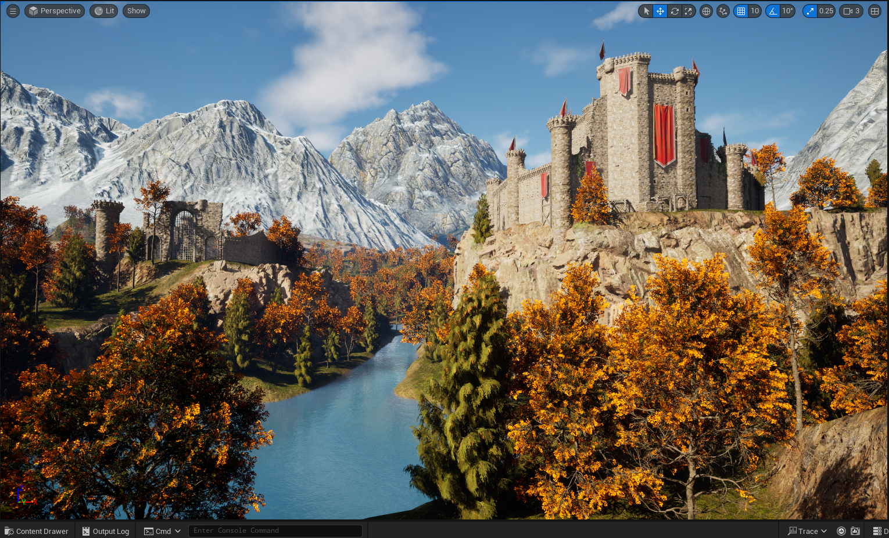
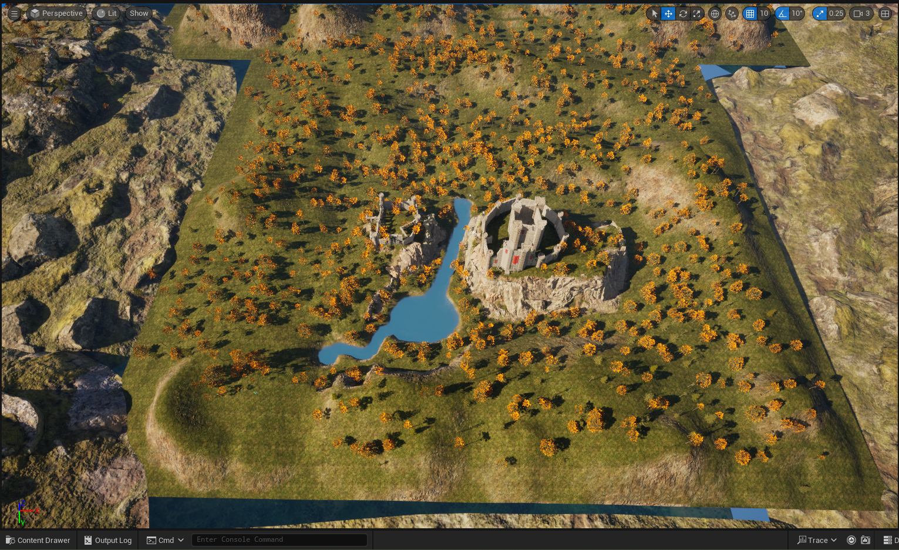
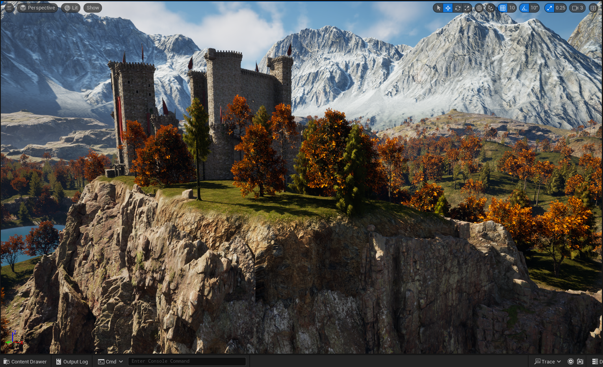
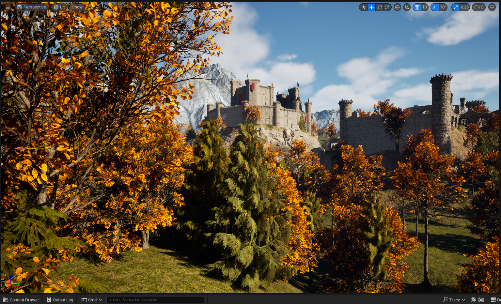

### What did you do last week?

Last week, I completed the main modular castle. 
With my remaining time, I had a choice between adding small details to the environment (grass, a trail or two, smaller shrubs, stones, twigs, etc.) or completing the smaller ruin I've thought about putting on the smaller hill of my cinematic shot. 
I decided that this latter item would add more to the scene than the small details, so that's what I went with. As you might expect, I have some updated screenshots for you below. 

I thought the tree placement in the cracked wall of the smaller ruin on the right in that last shot was a nice touch. 

### What do you plan to do this week?

This week, I plan to complete the final report for this project and otherwise wrap things up. 

### Are there any impediments in your way?

There are not!

### Reflection on the process:

I've been really glad with my choice of project, pleased with how well I scoped and partitioned the work, and impressed with what I've learned from it. 
This has been a really engaging and enjoyable project to work on. 
